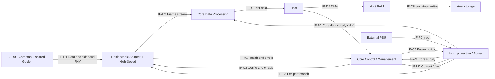

# 完整推导演示：可复用Camera接收验证盒

这是 v1.1 SYNTHETIC 教学设计，无公司规格或实测硬件数据。需求、IP 区间、持续速率、效率和热参数均为显式 ASSUMPTION。结论是有条件的器件容量包络；型号、pin plan、speed grade 和工程签核仍待真实资料验证。

## 需求与边界

应用为产线 Camera 接收验证：每小时 45 个 DUT；单工位占用 120 s（装卸20、配置10、测试90），availability=0.9（额外非计划损失）。每工位每周期一个 DUT，单工位能力=3600×0.9/120=27 DUT/h，因此需 ceil(45/27)=**2 个工位**。每工位一个 Camera 数据端口；同时采集一路共享 golden，供两个 DUT 对照，无需独占 golden 配置，也不允许测试中切换。故物理端口=2×1+1=**3**，总节拍能力54 DUT/h。若 golden 必须分别设不同曝光/时序，共享假设失效，重算端口和所有下游预算。

REQ-D 要求直到 Host 文件存储保留原始图像；REQ-R 要求支持五种 DUT profile，profile 数不等于端口数。允许组合如下，三端口在每行均同时激活，行与行互斥。golden 是额外对照格式。所有格式为有效像素，blanking 不隐含计入。

| Profile | width×height | fps / bpp | 单流 Gbit/s |
|---|---|---|---:|
| A | 1920×1080 | 60 / RAW12 | 1.492992 |
| B | 2560×1440 | 30 / RAW12 | 1.327104 |
| C | 3840×2160 | 30 / RAW12 | 2.985984 |
| D | 1920×1080 | 120 / RAW12 | 2.985984 |
| E | 1280×720 | 120 / RAW10 | 1.105920 |
| G（golden） | 1920×1080 | 30 / RAW12 | 0.746496 |

| Scenario | D1 | D2 | GOLDEN | 同时端口 / 总payload Gbit/s |
|---|---|---|---|---|
| NORMAL | A | B | G | 3 / 3.566592 |
| STRESS | C | D | G | 3 / **6.718464** |
| LOW | E | A | G | 3 / 3.345408 |

STRESS 是本例各共享 hop 最坏组合；通用流程仍需分别检查每跳最大值。协议电压、线缆、校准精度和器件阈值 UNKNOWN，暂不选 PHY/电源型号。Core内部采用128 bit×100 MHz数据路径候选，有效服务率假设0.8，可提供10.24 Gbit/s；目标clock的PVT时序待综合和布局验证，不能由容量计算决定speed grade。

| REQ | 可判定目标 | 推导 |
|---|---|---|
| REQ-D | 三种并发组合直到持续落盘无丢帧，每跳保留10%容量 | 采集/路由/背压/Host接收与存储FUNC-D |
| REQ-T | ≥45 DUT/h，两个并发工位+共享golden | 工位和共享资源FUNC-T；切换假设改变时重算 |
| REQ-C | Host控制、日志和模块profile可复用 | FUNC-C配置编排、FUNC-M监测 |
| REQ-P | DUT短路不使Core复位/丢首错 | FUNC-P支路保护和诊断 |
| REQ-S | DUT off无超过器件保证的注入，未知信号不被采为有效数据 | FUNC-S跨域保护和valid门控 |
| REQ-R | 五类候选在明确包络内替换 | FUNC-R模块身份/兼容性检查 |

系统内为Core控制/管理、可选数据处理、接口模块、DUT适配、电源、机壳；外部为Camera/DUT、Host/网络、PSU、示波器/逻辑分析仪、下载器。Display/load本示例N/A：输出直接由Host验证，不做显示或负载模拟。

Data、Control、Management可共享部分物理连接，但分别约束容量/错误/失联行为。Ground另列PSU return、DUT cable shield、Host/仪器地、chassis与shell；连接方式UNKNOWN，需真实布线后确定。

## 模块与分解

| MOD | FUNC/职责 | 边界与变更 |
|---|---|---|
| MOD-CORE | FUNC-C/M，状态编排、Host语义、日志 | 稳定API；启动/保护必须在数据FPGA失败时仍可解释 |
| MOD-DATA | FUNC-D，路由/CDC/缓存/Host传输 | 包络驱动实现；若直通满足需求可简化 |
| MOD-ADAPTER | FUNC-R与PHY配置、连接、电平/局部供电 | 每供应商profile与driver；高速/电源/机械一并兼容 |
| MOD-POWER | FUNC-P/S，输入与支路保护、测量 | 快速切断在硬件；Core负责策略和日志 |

## IF-C2接口契约示例

Producer为Core command engine，Consumer为Adapter controller/device，电气驱动owner按bus事务划分；Power策略owner仍Core，快速切断owner为Power硬件。协议候选为本地I2C/SPI，具体总线是DECISION pending（地址、bus长度和设备角色未齐）。

| 字段 | 本示例定义 |
|---|---|
| Electrical/Voltage | VDDIO、min/max阈值、common mode、Ioff均UNKNOWN，禁止提前定电平 |
| Direction/Bandwidth | 双向命令与状态，最低服务率/响应时间UNKNOWN；与test data独立预算 |
| Clock | 若I2C/SPI则Core发起；频率、clock stretching/边沿预算由器件+线长确定 |
| Reset/Enable | Adapter未ready时输出禁用；硬件保证Core/Adapter任一reset/config阶段默认态 |
| Idle | bus释放；RX/下游valid有确定解释；pull/termination网络待定 |
| Power-off | ON/OFF四组合均需Ioff/注入与残压验证；不能仅依赖GPIO Hi-Z |
| Ownership | 单一编排owner，事务仲裁与reset/升级移交明确；超时释放、失败锁定 |
| Fault | bus stuck触发局部隔离/恢复，不无界reset Core；总预算待测量定义 |
| Debug | Core事件时间戳、Adapter ID/readback、bus TP、PG/OE同时触发；探头负载需核 |
| Connector/SI/Isolation | pin/view/cable/ground/隔离方式UNKNOWN，由真实拓扑决定 |
| Compatibility | IF-C2 v0.1候选；adapter profile含HW/assembly/FW范围、支持命令、错误/ready语义；不兼容时保持支路和TX禁用 |

## 逐跳预算与架构决策

可重算输入：[初始候选](traffic-camera-proposed.json)、[调整后候选](traffic-camera-sized.json)、[资源参数](resource-camera.json)。每跳 factor 相对于有效图像payload；此处 Adapter 去除输入封装，Core 汇聚编码也在 Host 封装前终止，因此不同跳的编码开销不累乘。实际实现若保留上游封装须改下游 factor。capacity 是假设可持续能力，尚未实测。

| Hop / IF | STRESS payload Gbit/s | factor / efficiency | 所需 wire Gbit/s | 初始 capacity Gbit/s | 容量保留 headroom | 10%保留所需最低capacity |
|---|---:|---|---:|---:|---:|---:|
| INGRESS-D1 / IF-D1 | 2.985984 | 1.04 / 1 | 3.10542336 | 4 | 22.3644% | 3.45047040 |
| INGRESS-D2 / IF-D1 | 2.985984 | 1.04 / 1 | 3.10542336 | 4 | 22.3644% | 3.45047040 |
| INGRESS-GOLDEN / IF-D1 | 0.746496 | 1.04 / 1 | 0.77635584 | 4 | 80.5911% | 0.86261760 |
| CORE_AGG / IF-D2 | 6.718464 | 1.05 / 0.8 | 8.81798400 | 8 | **−10.2248%** | **9.79776000** |
| HOST_LINK / IF-D3 | 6.718464 | 1.06 / (64/66) | 7.34412096 | 10 | 26.5588% | 8.16013440 |
| HOST_DMA / IF-D4 | 6.718464 | 1 / 1 | 6.71846400 | 8 | 16.0192% | 7.46496000 |
| HOST_STORE / IF-D5 | 6.718464 | 1.02 / 1 | 6.85283328 | 7.2 | **4.8218%** | **7.61425920** |

初始方案两跳失败，瓶颈是 CORE_AGG（按相对保留后容量的利用率）。原始数据839.808 MB/s；含记录开销856.60416 MB/s，10%保留要求持续写盘至少**951.7824 MB/s**。900 MB/s不满足预留；器件宣传的缓存峰值不能填此字段。10 Gbit/s Host 链路在本例假设下满足，不能仅凭接口名称判定够或不够。

ADR-D1：CORE_AGG提升至10 Gbit/s（headroom11.82016%），Host存储验收目标提升至持续1000 MB/s（headroom14.339584%）；其它跳不变，三场景算术均满足。1 GB/s指十进制，不能混作1 GiB/s。存储、驱动、CPU和协议实现仍需端到端测试。

### 存储容量与器件档位

FPGA只承担 CORE_AGG 最大2 ms零服务窗口，Host磁盘250 ms停顿由Host RAM吸收。独立队列按每端口跨场景最大值：D1/D2各746,496 B，GOLDEN为186,624 B；每队列另预留65,536 B突发，得到812,032 / 812,032 / 252,160 B，共**1,876,224 B**。序列号/时间戳假设放在独立header区，payload队列metadata_factor=1；实际若内联须增加。

| 存储备选 | 计算与结果 | 候选及未关闭条件 |
|---|---|---|
| BRAM-only | 每块 nominal36 Kibit、usable32 Kibit、packing0.9；逐队列ceil得到221+221+69=511块；固定IP64块；ceil(575/0.7)=**822块** | 候选512块失败。更大BRAM档仍可能可行，需实际宽深/端口/CDC/布局验证 |
| URAM data + BRAM fixed IP | nominal288 Kibit、usable256 Kibit、packing0.9；队列28+28+9=65块；ceil(65/0.7)=**93 URAM**，另ceil(64/0.7)=**92 BRAM** | 候选96 URAM+128 BRAM算术满足；单时钟URAM不是双时钟FIFO替代品，CDC staging/读写延迟/ECC尚未关闭 |
| 外部DDR + BRAM fixed IP | 数据容量下界ceil(1,876,224/0.8)=**2,345,280 B**；读写2次，效率0.65、保留20%，带宽≥**25.840246 Gbit/s** | 候选128 MiB、32 Gbit/s总线、128 BRAM算术满足；须补controller资源和实测效率/刷新/仲裁/时延 |

所有固定IP区间都是教学占位估算；URAM与DDR新增controller/CDC的真实成本未知，必须更新后重算，不能直接选型。12 Mbit级缓存不自动要求URAM：应比较器件实际可用块数和外部存储代价。legacy [budget-demo](budget-demo.json) 保留为兼容回归：4路同构输入5.971968 / 7.838208 Gbit/s、2.0224%余量、容量≥8.70912 Gbit/s、2 ms缓存1,492,992 B，均与新例不同。

Host磁盘停服250 ms对应209,952,000 B payload，含1.02记录开销、额外1 MiB突发并保留10%空余，需要239,110,685 B；候选**256 MiB专用写盘环**。DMA 5 ms另需4,199,040 B payload，候选**8 MiB独立DMA环**，不把同一空闲区同时算给两个队列。存储恢复后按1 GB/s写入、856.60416 MB/s继续到达，214.15104 MB积压约1.494 s排空；假设两次250 ms停顿起点间隔≥2 s，须实测。更密集停顿或RAM耗尽后的背压会推翻FPGA 2 ms假设。

资源推导顺序如下，数据由 `resource` 命令重算：

| 类别 | 来源与计算 | 档位包络/下一证据 |
|---|---|---|
| Serial channels | 三个Adapter→Core物理接口各4 lane，另Host1+回环1+预留2 | **16 GT**；本例是适配后的内部串行接口，不能把Camera原生MIPI lane直接等同GT。Ingress总capacity4 Gbit/s假设4×1 Gbit/s，需核候选GT最低速率；Host lane需10 Gbit/s及refclk/tile/package验证 |
| IO / VCCIO | 1.8 V组72脚，3.3 V组24脚；每Bank40可用脚再保留20% | **3+1 Bank下界**；差分按2脚、GT单列；family是否支持电压、clock/VREF/专用脚与pin map均待关闭 |
| LUT / FF / DSP | 各功能区间×实例数，总LUT17,800–36,000，FF23,500–48,200；本例无像素算术DSP功能 | 利用率≤70%对应**≥51,429 LUT、≥68,858 FF**；DSP占位0。这些是虚构教学区间，非CSI-2/MAC厂商IP开销，必须换同配置综合/估算 |
| Timing / speed grade | Core128 bit×100 MHz、GT类型/速率及PVT | datapath容量候选满足；speed grade **UNKNOWN**，综合+布局时序报告后决定，不给型号 |

LUT/FF区间来源明细均标ASSUMPTION：deframer×3（1500–3000 / 2000–4500），CDC/FIFO控制×3（400–900 / 700–1300），router×1（1800–3500 / 2200–4200），packager×1（1500–3000 / 2000–4000），MAC/DMA×1（8000–16000 / 10000–20000），management×1（800–1800 / 1200–2600）。选择真正CSI-2 RX、PCIe或USB IP时新增或替换对应项，不套用本例数字。

### 功耗、延迟与复用的数值边界

盒内负载20 W/效率0.9（其中FPGA暂估12 W），外置Camera 3×8 W/效率0.85，风扇3 W：输入**53.4575 W**，扣除盒外24 W负载后机内热**29.4575 W**。预留20%对应额定≥66.8219 W、24 V时≥2.7843 A；实际按输入最低电压和inrush再核。环境45°C、目标Tj85°C，允许有效热阻≤3.3333°C/W；假设2.5°C/W得75°C，须用实际功耗/PVT/风道验证。允许机内温升20°C则等效机壳热阻≤0.679°C/W，仅用于散热候选筛选。

延迟终点分开：触发到Host RAM末字节，最慢30 fps完整帧采集33.334 ms + Adapter0.2 + FPGA FIFO2 +路由0.1 +传输1 +DMA5 = **41.634 ms**，候选验收≤45 ms。持久化另受写盘队列与250 ms停顿影响，不能声称同一个45 ms。示例假设一次写批次≤32 MB、持续服务时≤32 ms，则孤立停顿模型下估计上界41.634+250+32=**323.634 ms**；候选持久化≤350 ms尚需验证排队/flush语义、重复停顿与断电一致性，当前状态PLANNED。

复用收益例：五变体各独立开发/回归160 h，共800 h；Core240 h + Adapter每变体60 h +年度维护80 h，共620 h，节省180 h。额外平台硬件成本若折合90 h，净节省90 h；该数量下回本点 ceil((240+80+90)/(160−60))=5变体。工时与成本均是假设，不把模块化本身计为收益。

ADR-P1：Core管理与DUT用可独立保护的支路。选fuse/eFuse/限流器件前核输入范围、inrush、trip时间、reverse current与热；共享输入造成的共同故障仍需计算/测试，不自动添加第二PSU。

ADR-R1：厂商PHY+相关clock/power/profile封装为Adapter；Core保留语义API。若五种Camera中某种超出数据/电气/热包络，则更新Core或分平台族，不承诺只改Adapter。

## Lifecycle总览与依赖

表中每行需在实际项目扩展成模板要求的16字段逐模块矩阵；这里是可读总览，并不自称完整电气签核。

| State | Core / Data / DUT power | TX/RX/ownership关键行为 | 推进或失败条件 |
|---|---|---|---|
| OFF | 定义电源off，外部Host/仪器可能on | 强制评估外部注入；不能假设无电 | input valid |
| POWER_APPLIED | 保护和管理rail建立，Data/DUT未开 | 硬件默认禁TX、保护生效 | AON有效或fault |
| STANDBY | Core可运行，Data/DUT按策略off | 管理可读；下游valid屏蔽 | 合法profile与start请求 |
| INITIALIZATION | 按rail/clock依赖启动Data | reset保持，OE禁用 | PG/clock稳定，超时入fault |
| CONFIGURATION | Data配置，DUT按器件依赖开 | FPGA DONE后还要业务ready；不提前advertise | 配置/readback完成 |
| LINK_TRAINING | 必要域on | 专用训练行为，管理仍可用 | 成功入idle，预算耗尽入fault |
| IDLE | 部分域允许低功耗 | 驱动空闲不能导致浮空误采；owner明确 | start test |
| ACTIVE | 所需域on | 数据与控制独立，统计drop/error | stop或fault |
| FAULT | DUT支路优先隔离；Core尽量存活 | 首错持久化，禁受影响TX | 条件允许则受控recovery |
| RECOVERY | 只重启相应域 | 重新建立依赖、清理旧状态，不能无限retry | ready或锁定fault |
| SHUTDOWN | 停事务→禁TX/隔离→关DUT/Data→放电 | 保留管理记录，输入骤失另有硬件默认 | standby/off |

依赖：输入→AON→管理最小功能；输入→Data rails→clock→reset release→配置→业务ready；DUT供电/本地接口配置→remote access→sensor config→training→data。实际clock/供电顺序由器件确定。任何“通过未建立的远端link去开启该link”均需本地启动路径。

重点差分为DUT_OFF↔ACTIVE：驱动变了，但常供电pull-up可能不变而仍危险；RX的禁用Hi-Z与下游解释分别分析。另查ACTIVE→FAULT硬件切断和所有权窗口；两个端点都禁TX仍不能证明中间无毛刺。

## 验证追踪与Debug

| REQ→FUNC→MOD→IF→IMP | RISK/INV | VAL与判据 |
|---|---|---|
| REQ-D→FUNC-D→MOD-DATA→IF-D2/D3→候选更高容量链路 | 持续过载/INV数据完整 | VAL-D：三场景三流序号/CRC/时间戳直到文件校验一致、无丢帧，每跳≥10%容量保留；候选连续2小时（ASSUMPTION），Host RAM可见≤45 ms，持久化≤350 ms；250 ms停服/恢复及重复周期专项验证 |
| REQ-P→FUNC-P→MOD-POWER→IF-P3/M2→独立支路保护 | DUT短路/INV-01 | VAL-P：最差输入/负载短路，Core rail在保证区、无reset、首错记录完整、Ttrip满足器件/系统限制（值UNKNOWN） |
| REQ-S→FUNC-S→MOD-ADAPTER→IF-C2→断电隔离候选 | 反灌/INV-03/04/05 | VAL-S：四供电组合+转换窗，残压/注入/下游状态满足准确数据表与契约 |
| REQ-R→FUNC-R→MOD-ADAPTER→IF-C2→profile/driver | 错模块/错固件 | VAL-R：不兼容组合安全拒绝；五变体逐项兼容表与冷启动/吞吐回归 |

VAL全部PLANNED。Bring-up从输入限流与待机测点开始，逐gate推进；没有阈值不能把“看起来正常”写PASS。无图时先看首个分叉：power/PG→clock/reset→config/readback→训练/数据→Host；保存首错再受控恢复。
