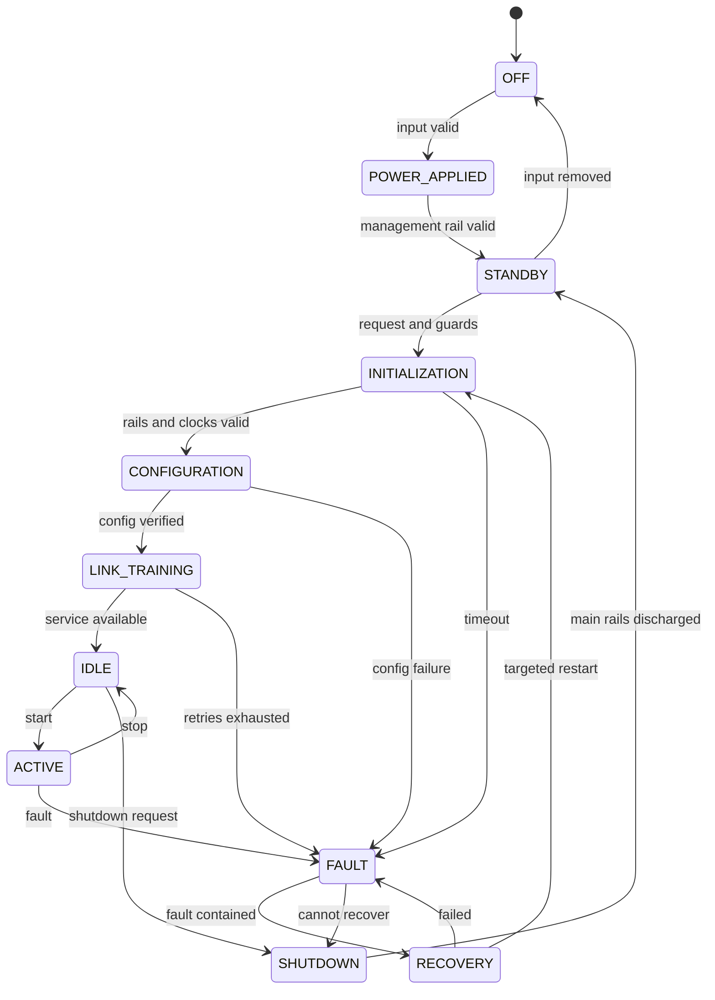

# Lifecycle 与 State Differential

## 分层并行状态

分别建立系统策略、模块、电源域、协议状态。基础词汇：OFF、STANDBY、POWER_APPLIED、INITIALIZATION、CONFIGURATION、LINK_TRAINING、IDLE、ACTIVE、FAULT、RECOVERY、SHUTDOWN。按需增加 UPDATE、CALIBRATION、DUT_ABSENT、BROWNOUT、HOST_DISCONNECTED；N/A 有理由。

OFF 指指定电源关闭，不保证所有外部线无电；STANDBY 明确哪些 AON 域存在。某些系统必须先 POWER_APPLIED 才 STANDBY，不能依名称强迫顺序。

实际图补任意有电状态的 brownout/input loss、Host reboot、DUT插拔和部分域重启。每条转换记录 trigger、guard、actions、硬件默认、owner、最大时间、timeout、观察点、失败去向。无时钟阶段不能假设同步release可执行。

## Module × State Matrix

每个单元包含 power、clock、reset、enable、GPIO、receiver、transmitter、termination、bias、pull-up/down、ownership、firmware、communication、protection、back-power risk。写具体电气状态与证据，不写空泛“safe”；不适用写 N/A + 原因。

先覆盖两端 ON/ON、ON/OFF、OFF/ON、OFF/OFF 与最危险 reset/config/ownership 组合；记录裁剪条件和剩余风险。关键共享域再展开三方及多端组合，pairwise 不等于完整证明。

## 差分与转换窗口

输出 Item | State A | State B | Difference | Risk | Evidence | Validation。至少选择相关的 OFF↔STANDBY、INIT↔IDLE、IDLE↔ACTIVE、ACTIVE↔FAULT、FAULT↔RECOVERY；BOOT 是区间别名，明确对应哪些阶段。

检查“不变但不安全”：两态RX均floating、pull-up均接AON、OE均UNKNOWN，也要列风险。缺字段/模块新增移除必须显示，缺项不是N/A。

额外分析转换窗口：电源斜率/残压、PG延迟/抖动、reset pulse、OE延迟、方向移交、boot pin、reconfiguration、firmware crash。端点正确仍可能短暂争用、反灌或提前ready。

## 候选不变量：结合项目确认适用范围

| ID | 不变量 | 实现和验证义务 |
|---|---|---|
| INV-01 | DUT短路不使控制器掉电/丢关键日志 | 最差负载和源阻抗下测Core rail、reset、日志及切断时间 |
| INV-02 | Host reboot不擅自改变DUT power，除非失联策略规定 | 测会话丢失/重连、电源保持、幂等命令 |
| INV-03 | FPGA未配置/复位不驱出未知信号 | 硬件OE/PG gate、拉阻与pin默认；捕捉启动窗 |
| INV-04 | DUT off注入不超过允许值、不出现幽灵供电 | 覆盖pull-up、TX、下载器、PoC、测量回路；测残压和注入 |
| INV-05 | 无驱动时下游逻辑有确定解释 | failsafe/bias或受保证valid mask，不强制禁用RX本身恒0 |
| INV-06 | 半双工最多一方主动驱动 | release/grant、最坏延迟、reset、双方异常 |
| INV-07 | 服务ready后才对外advertise | 检查配置/内存/clock/reset因果门控，如AUX/HPD |
| INV-08 | Debug接入不破坏正常路径 | 探头负载、stub、接地、双主、下载器供电 |

不变量不是普适定律；说明例外/替代机制。RX disabled可以Hi-Z，但下游必须可靠屏蔽或偏置，验证unmask窗口。
