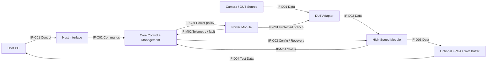

# 模块、Plane 与通用架构

## 职责分类

| 模块族 | 职责 | 边界 |
|---|---|---|
| Core Control | 状态机、配置编排、事件、watchdog 策略、恢复 | 语义命令；未启动默认态由硬件保证；MCU/FPGA/SoC 是实现选项 |
| DUT Adapter | DUT connector、pin mapping、电平、保护、可选ID EEPROM | 收敛 DUT 特有约束；ID 不证明带电插拔兼容 |
| High-Speed Interface | 协议端点、PHY、均衡/桥接、局部 clock/sideband | 高速通道、参考时钟和厂商驱动可形成一个兼容单元 |
| Power | 输入/反接/热插拔、内部和DUT电源、限流、测量 | 设定与硬件切断 owner；不依赖故障域中的CPU保护自身 |
| Management / Monitor | 电压/电流/温度/link/error/health/版本/日志 | 传感器可分布，告警解释与持久记录有明确 owner |
| Host Interface | 会话、命令、数据、部署所需权限 | control/test data 分别定义队列、容量和失联行为 |
| Debug / Instrumentation | JTAG/SWD/UART/Flash/TP/trigger/clock/loopback/注入 | 不引入未评估 stub、双主或回流 |
| Mechanical / Connector | 防误插、锁紧、方向、散热、机壳、地/屏蔽、维修 | 空间、插拔次数、拆装和通道长度属于契约 |

快速切断和软件告警是不同职责；一个传感器可归 Power 实现、Management 收集，不能两个模块争抢保护动作。模块是责任边界，不机械等同于板卡。

## 推荐起点

该结构来自跨项目模式归纳，适用于有主动控制和复用需求的候选架构，不是默认 BOM。

完整设计另画含 Core 供电的 Power Tree 和 Ground 图。直通可删除 BUF；模拟 Camera 时按 Source 重新推导方向；高速包络不适合板间连接时合并 HS/BUF，不硬塞通用背板。

## Flow 分析

- Data：逐边标 payload/wire、格式、编码/packet overhead、lane、并发、buffer、latency、clock domain、瓶颈、CRC/drop/sequence counter 和观察点。
- Control：Host → Core → local bus → DES → reverse channel → SER → sensor；明确配谁、地址/alias、仲裁、超时、重试、本地恢复入口。远端链路未建立时，不能依赖远端配置来开启它自身。
- Management：采样 → 时间戳状态/事件 → 告警 → 日志 → Host；data flood、link down、部分掉电时能否报告；共享介质需容量/QoS 证据。
- Power：输入 → 保护 → Core/AON 和 DUT 支路 → 线缆/负载；并列回流、PG、切断、测量位置，不能只写电压名。

## 模块化评分，每维0–4

| 维度 | 0 / 2 / 4 的证据锚点 |
|---|---|
| Coupling | 任意换型全板重做 / 部分传播已列 / 硬软件机械传播有界且验证过 |
| Cohesion | 无关职责混合 / 基本可解释 / 同类变化集中、责任唯一 |
| Interface stability | 只有pin表 / 有电气时序 / 状态、版本、包络与回归完整 |
| Replaceability | 不能单换 / 能换未验证 / 装配、防误插、兼容和替换验收完整 |
| Dependency direction | Core 散布厂商寄存器 / 部分封装 / 语义API与有界driver，启动不循环 |
| Reuse | “以后可能” / 两个具体变体 / 多变体矩阵与成本收益 |
| Testability | 只能重启 / 有观察点 / 能隔离测试，日志不随故障丢失 |

附证据和 UNKNOWN；总分不能掩盖不变量失败。换型检查 payload/line rate、lane、pin/Bank/IO、clock/jitter、reset/boot、功率/热、connector/cable/PoC、驱动/API、机械、防护、校准、供应链。输出 changed / retest / unchanged-with-evidence；图可达只说明可能受影响。

复用价值比较“预计次数×每次节省改板/验证成本−首次模块化/连接器/维护代价”，用范围做敏感度分析。五种 Camera 不等于五套 Core，也不保证一套 PHY 覆盖全部。
